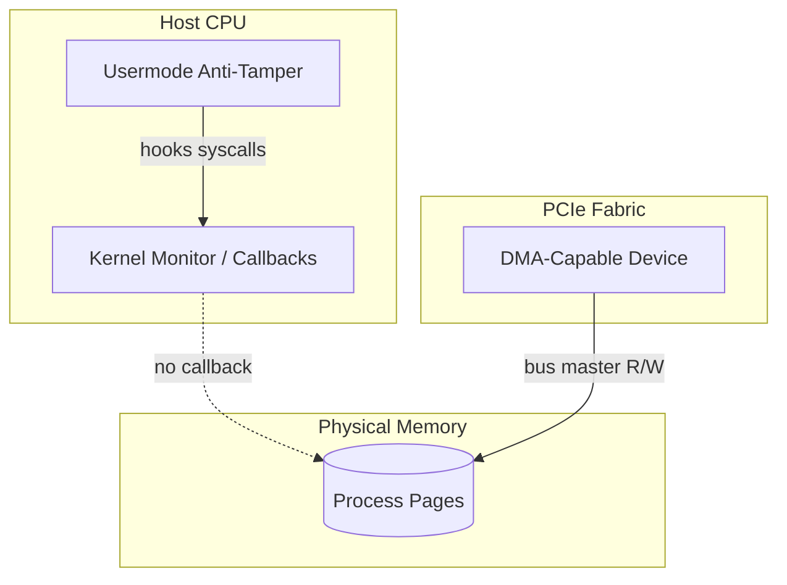

# DMA Memory Access — Threat Model Lab

> **Research repository** documenting PCIe DMA attack surfaces, IOMMU policy gaps, and defensive telemetry for anti-cheat / platform security teams.

---

## Table of Contents

- [Overview](#overview)
- [Key Research Areas](#key-research-areas)
- [System Architecture](#system-architecture)
- [Lab Setup](#lab-setup)
- [Detection Signals](#detection-signals)
- [Mitigation Checklist](#mitigation-checklist)
- [Disclaimer](#disclaimer)
- [License](#license)

---

## Overview

Direct Memory Access (DMA) enables bus-master devices to read/write physical memory **without invoking the kernel syscall table**. This repo collects **lab notes, diagrams, and detection heuristics** from controlled hardware research—not distributable bypass tooling.

**Use case:** Understand why software-only anti-tamper fails when memory is touched from outside the CPU trust boundary.

---

## Key Research Areas

### Hardware Path Analysis
- **PCIe TLP semantics** — read/write completion paths vs. kernel callbacks
- **FPGA / dev board bring-up** — firmware flash flow documentation
- **IOMMU / VT-d mapping** — when remapping is enabled but incomplete
- **Latency benchmarks** — DMA read vs. `ReadProcessMemory` (lab conditions)

### Firmware & Bus Layer
- **BAR mapping** — what userspace/kernel can and cannot see
- **Device allowlists** — tournament / enterprise policy models
- **USB4 / tunnel edge cases** — consumer firmware gaps

### Blue-Team Telemetry
- **Unexpected bus masters** — inventory baselines
- **Memory encryption awareness** — platform-specific notes (TME, etc.)
- **Correlation with game integrity events** — timeline templates

---

## System Architecture

---

## Lab Setup

### Prerequisites
- Windows 11 64-bit or Linux test host with **VT-d / IOMMU** documented
- Isolated VLAN — **no production game clients**
- Research DMA hardware with **owned firmware only**
- Administrator access for IOMMU policy verification

### Steps
1. Clone this repo and review `docs/threat-model.md`
2. Enable IOMMU in firmware; record before/after device trees
3. Run inventory scripts in `scripts/` (read-only enumeration)
4. Document findings in `cases/` using the provided template

---

## Detection Signals

| Signal | Severity | Notes |
|--------|----------|-------|
| Unknown PCIe endpoint with bus mastering | Critical | Baseline per machine class |
| IOMMU disabled in firmware | High | Common on consumer boards |
| New DMA-capable driver without WHQL trail | Elevated | Correlate with install time |

---

## Mitigation Checklist

- [ ] VT-d / IOMMU enabled and verified in OS
- [ ] Strict allowlist for DMA-capable devices in high-trust environments
- [ ] Assume **software hooks alone are insufficient** for external DMA

---

## Disclaimer

**Research & education only.** No exploit payloads, game-specific bypass binaries, or tournament-evasion tooling.

---

## License

MIT License — see [LICENSE](LICENSE).
